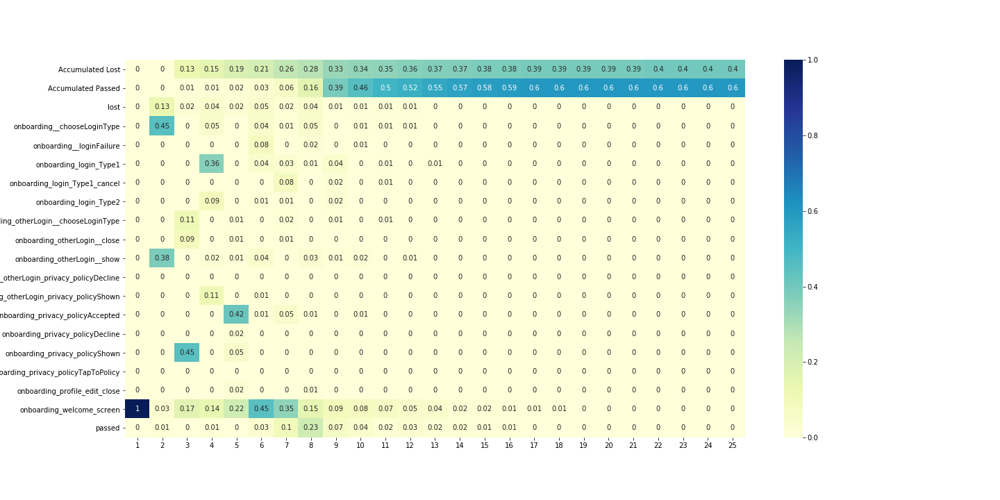
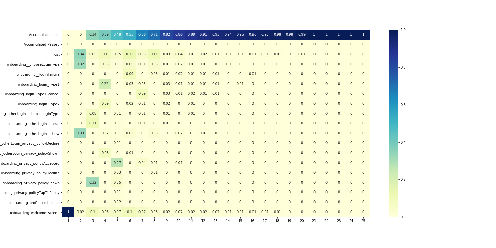
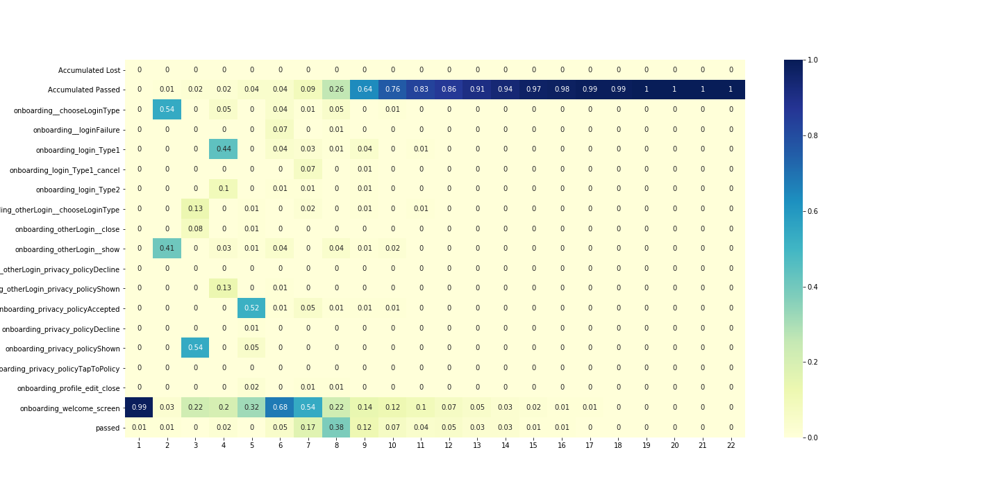
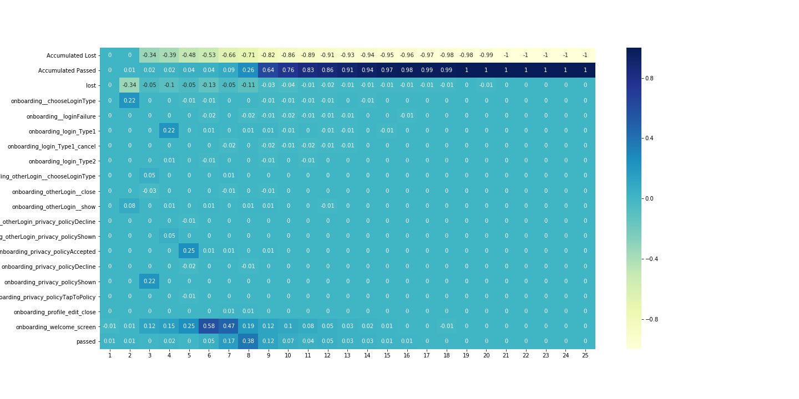
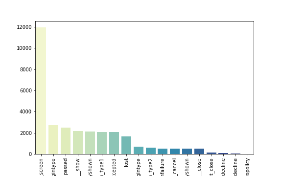
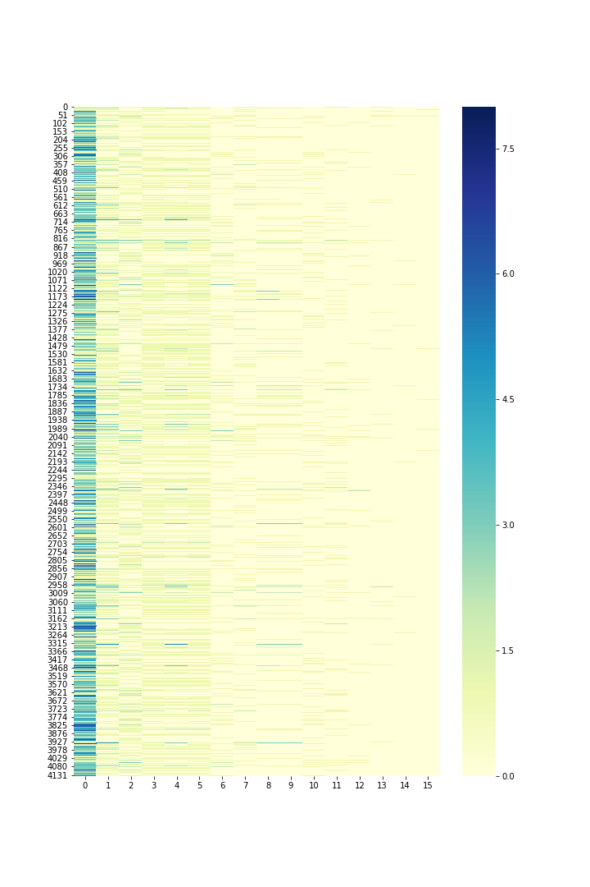
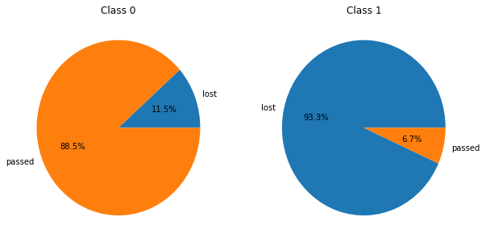
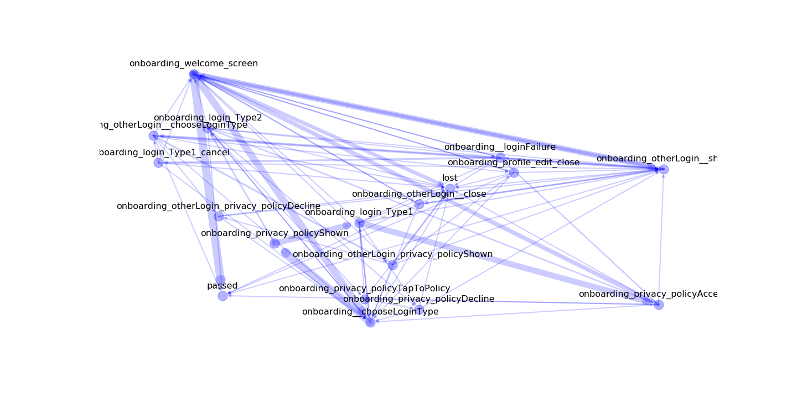
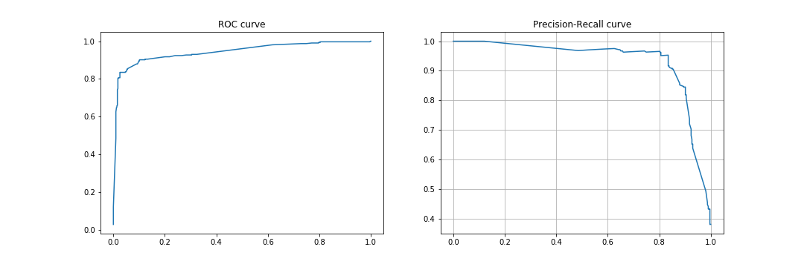

Analysis
========

Please, see the `data preparation tutorial <data_preparation.md>`__ for
understand how to prepare data for this functions ## Load data

.. code:: python

    import pandas as pd
    df = pd.read_csv('example_datasets/train.csv')

First steps
-----------

Let us describe onboarding lost-passed case.

**Goal**

Our goal is to detect interface elements / screens of an app at which
users' engagement drops significantly and induce them to leave the app
without account registration.

**Tasks**

1. Collect data
2. Prepare data
3. Analyze data

   1. Build pivot tables
   2. Visualize users path in the app
   3. Build the classifier

      1. Classifier helps you to pick out specific users paths
      2. Classifier allows to estimate the probability of user's leaving
         from the app based on his current path. One can use this
         information to dynamically change the content of the app to
         prevent from that.

**Expected results**

1. One will identify the most "problematic" elements of an app
2. One will get the classifier which will allow you to predict user's
   leaving from the app based on current user's behaviour

Import retentioneering framework
~~~~~~~~~~~~~~~~~~~~~~~~~~~~~~~~

Firstly, we need to import data and set documents config with the export
folder (you can leave it empty, then it will create folder with current
timestamp).

.. code:: python

    from retentioneering import analysis
    settings = {
        'export_folder': './experiments/new_experiment'
    }

Events\` probability dynamics
~~~~~~~~~~~~~~~~~~~~~~~~~~~~~

.. code:: python

    desc = analysis.get_desc_table(df,
                                   settings=settings,
                                   plot=True,
                                   target_event_list=['lost',
                                                      'passed'])

In columns of the table there are serial numbers of the user's steps
from the user path. In rows of the table there are events themselves.

In cells you will see the probability of user's choice event at every
step.

It's difficult to make complicate analysis from that table so we should
split our users to those who leave the app and those who passed on.

Difference in passed and lost users behaviour
~~~~~~~~~~~~~~~~~~~~~~~~~~~~~~~~~~~~~~~~~~~~~

.. code:: python

    # find users who get lost
    lost_users_list = df[df.event_name == 'lost'].user_pseudo_id.unique()

    # create filter for lost users
    filt = df.user_pseudo_id.isin(lost_users_list)

    # filter data for lost users trajectories
    df_lost = df[filt]

    # filter data for passed users trajectories
    df_passed = df[~filt]

Plot dynamics for different groups

Lost

.. code:: python

    desc_loss = analysis.get_desc_table(df_lost,
                                        settings=settings,
                                        plot=True,
                                        target_event_list=['lost',
                                                           'passed'])

Passed

.. code:: python

    desc_loss = analysis.get_desc_table(df_passed,
                                        settings=settings,
                                        plot=True,
                                        target_event_list=['lost',
                                                           'passed'])

.. code:: python

    diff_df = analysis.get_diff(desc_loss,
                                desc_passed,
                                settings=settings,
                                precalc=True)

Agregates over user transitions
~~~~~~~~~~~~~~~~~~~~~~~~~~~~~~~

Let us aggregate our data over users transitions

.. code:: python

    agg_list = ['trans_count', 'dt_mean', 'dt_median', 'dt_min', 'dt_max']
    df_agg = analysis.get_all_agg(df, agg_list)
    df_agg.head()

Out:
.. code-block:: none

                        event_name                      next_event  trans_count
    0  onboarding__chooseLoginType                            lost            1
    1  onboarding__chooseLoginType          onboarding_login_Type1          414
    2  onboarding__chooseLoginType          onboarding_login_Type2          159
    3  onboarding__chooseLoginType  onboarding_privacy_policyShown         2133
    4     onboarding__loginFailure                            lost            1

We can see which transitions take the most time and how often people
have use different transitions.

We can choose the longest 10 user's path.

.. code:: python

    df_agg.sort_values('trans_count', ascending=False).head(10)

Out:
.. code-block:: none

                               event_name                         next_event  trans_count
    84          onboarding_welcome_screen          onboarding_welcome_screen         5021
    85          onboarding_welcome_screen                             passed         2330
    3         onboarding__chooseLoginType     onboarding_privacy_policyShown         2133
    79          onboarding_welcome_screen        onboarding__chooseLoginType         1938
    67     onboarding_privacy_policyShown             onboarding_login_Type1         1675
    11             onboarding_login_Type1  onboarding_privacy_policyAccepted         1666
    82          onboarding_welcome_screen        onboarding_otherLogin__show         1601
    62  onboarding_privacy_policyAccepted          onboarding_welcome_screen         1189
    78          onboarding_welcome_screen                               lost         1043
    47        onboarding_otherLogin__show          onboarding_welcome_screen          876

You can see events in which users spend most of the time. It seems
reasonable to analyze only popular events to get stable results.

Adjacency matrix
~~~~~~~~~~~~~~~~

Ajecancy matrix is the representation of graph. You can read more about
it on the `wiki <https://en.wikipedia.org/wiki/Adjacency_matrix>`__.

.. code:: python

    adj_count = analysis.get_adjacency(df_agg, 'trans_count')
    adj_count

Out:
.. code-block:: none

                                          onboarding_login_Type1   onboarding_privacy_policyShown
    onboarding_login_Type1                                   0.0                              0.0
    onboarding_privacy_policyShown                        1675.0                              0.0
    onboarding__loginFailure                                 0.0                              0.0
    onboarding_privacy_policyTapToPolicy                     0.0                              0.0
    onboarding_welcome_screen                                0.0                              0.0
Users clustering
~~~~~~~~~~~~~~~~

Also one can clusterize users by events' frequency choice

.. code:: python

    countmap = analysis.utils.plot_frequency_map(df, settings, )

One that plot one can see that some of users have pretty close
frequencies of different functions usage.

And we can see that it is helpful to separate groups with different
conversion rates.

.. code:: python

    analysis.utils.plot_clusters(df, countmap, n_clusters=5, plot_cnt=2)

Graph visualization
~~~~~~~~~~~~~~~~~~~

We have to options for plotting graphs: 1. With python (this is local)
2. With our API
(``you sends your data to our servers, we don't saving it, just visualize``)

Second option plots much better and obvious graphs.

.. code:: python

    analysis.utils.plot_graph_python(df_agg, 'trans_count', settings)

.. code:: python

    from retentioneering.utils.export import plot_graph_api
    plot_graph_api(df_lost, settings)

Lost-Passed classifier
~~~~~~~~~~~~~~~~~~~~~~

Model fitting
^^^^^^^^^^^^^

.. code:: python

    clf = analysis.Model(df, target_event='lost', settings=settings)
    clf.fit_model()

It returns metrics of quality of model.

PUT HERE DESCRIPTION OF METRICS
===============================

Model inference
^^^^^^^^^^^^^^^

We have data for new users, who is not passed or lost already.

Let us load it to pandas

.. code:: python

    test_data = pd.read_csv('example_datasets/test.cdv')

Now we can predict probabilities for new users

.. code:: python

    prediction = clf.infer(test_data)
    prediction.head()

Understanding your data
^^^^^^^^^^^^^^^^^^^^^^^

You can plot projection of users trajectories to understand how your
data look likes.

.. code:: python

    clf.plot_projections()

Understanding prediction of your model
^^^^^^^^^^^^^^^^^^^^^^^^^^^^^^^^^^^^^^

Also you can plot results of the model inference over that projections
to understand cases where your model do bad

.. code:: python

    clf.plot_projections(sample=data.event_name.values, ids=data.user_pseudo_id.values)

Visualizing graph for area
^^^^^^^^^^^^^^^^^^^^^^^^^^

From previous plot you can be interested what trajectories has high and
conversion rates.

You can select the area on that plot and visualize it as a trajectories
graph.

.. code:: python

    # write coordinates bbox angles

    bbox = [
        [-4, -12],
        [8, -26]
    ]

    clf.plot_cluster_track(bbox)

The most important edges
^^^^^^^^^^^^^^^^^^^^^^^^

You can found what was the most important edges and nodes in your model
for debugging (e.g. it helps you to understand 'leaky' events) or to
find problem transitions in your app.

Edges:

.. code:: python

    imp_tracks = clf.build_important_track()
    imp_tracks[imp_tracks[1].notnull()]

Nodes:

.. code:: python

    imp_tracks[imp_tracks[1].isnull()][0].values

